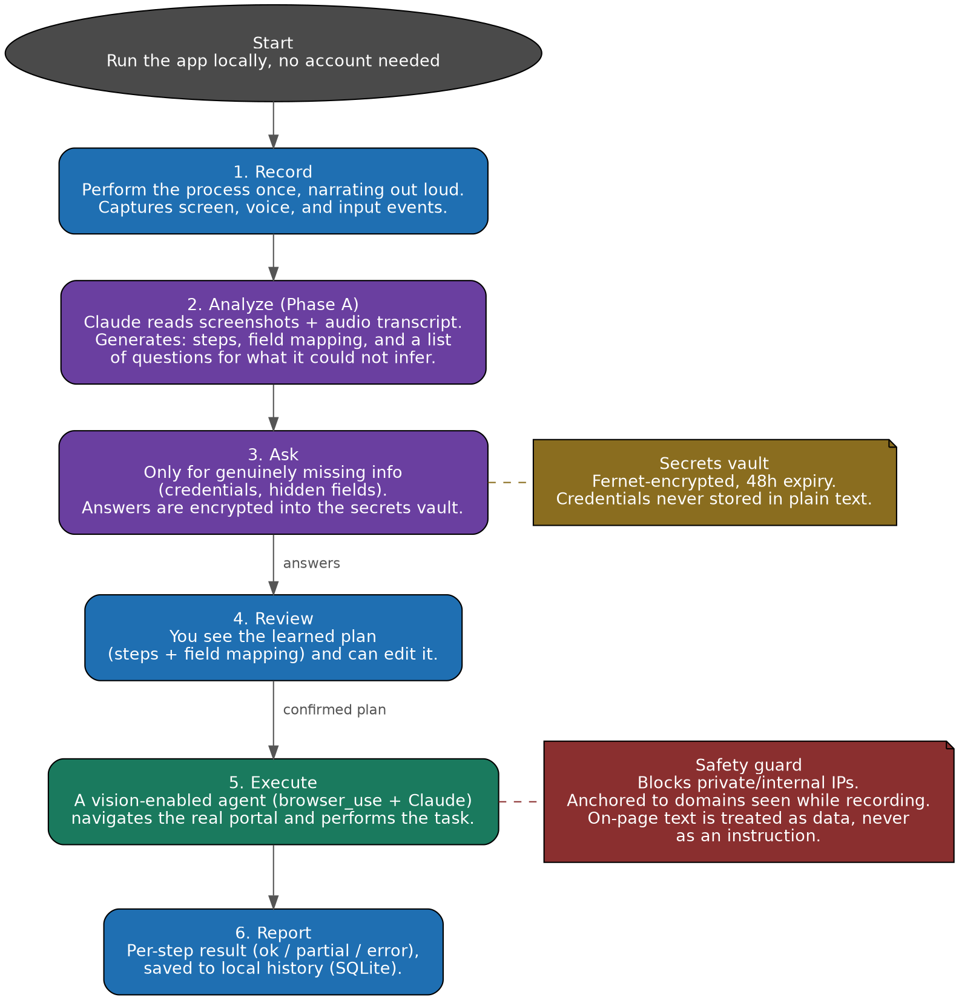

# HearVision AI

**Show it a repetitive process once. It learns by watching your screen and listening to you explain it. If anything is unclear, it asks before touching anything on its own. After that, it repeats the process by itself.**

Built to be installed and adapted for any individual project -- it doesn't assume a specific company, sales team, or process type.

&nbsp;

## How it works

| Step | What happens |
|---|---|
| **1. Recording** | You perform the process normally in your browser while narrating out loud what you're doing |
| **2. Analysis** | Claude interprets the screenshots, the audio, and the page structure to understand the flow and the field mapping |
| **3. Questions** | Before automating anything, the AI asks only for what it couldn't infer -- credentials, data that never appeared on screen |
| **4. Review** | You see the plan it learned (steps + field mapping) and correct whatever needs fixing |
| **5. Execution** | A vision-enabled agent (browser_use) navigates the real portal and does the work -- a purchase, a data update, a verification, whatever the process requires |
| **6. Result** | You see exactly what happened, step by step |

&nbsp;

## Design principle: ask first, don't improvise

This is the core idea behind the architecture: Phase A (`core/processor.py`) explicitly separates "what can already be inferred from the screenshots/page" from "what genuinely needs to be asked" (credentials, data that never appeared on screen). The agent does not guess at that information -- it asks before execution starts. Once it starts, if something genuinely goes wrong (an unexpected login, a captcha, a page that won't load), it stops and reports rather than inventing an action outside the plan.

The same principle extends to on-page content during execution: text on a visited page is treated as data, never as an instruction. If a page tries to redirect the agent's goal (a classic prompt-injection pattern), the agent ignores it, logs it, and continues with the original plan.

&nbsp;

## Setup

```bash
git clone <your-repo-url>
cd hearvision-ai
pip install -r requirements.txt
playwright install chromium
cp .env.example .env   # fill in at least ANTHROPIC_API_KEY
```

**Run the web interface:**

```bash
uvicorn backend.api:app --reload --port 8000
```

Open `http://localhost:8000` -- the entire flow happens there, no account or login required.

**Or use the CLI**, if you'd rather skip the browser:

```bash
python main.py
```

Relevant environment variables (see `.env.example`): `ANTHROPIC_API_KEY` (required), `GROQ_API_KEY` (audio transcription, optional), `ELEVENLABS_API_KEY` (agent voice, optional), `HEARVISION_ENC_KEY` (credential encryption -- generated automatically if not set), `AGENT_MAX_STEPS` / `AGENT_TIMEOUT_SEG` / `AGENT_HEADLESS` (optional).

&nbsp;

## Single-user by design

There are no accounts, logins, or organizations. `backend/api.py` keeps its state (an in-progress recording, the current plan) in the process's memory, without per-user isolation. If more than one person needs to use it without stepping on each other's state, each person should run their own instance (a different port, or their own machine) -- this isn't meant to be served as a multi-tenant SaaS as-is.

It also doesn't generate tickets, send emails, upload to spreadsheets, or maintain an analytics dashboard. The architecture stays deliberately small: record, analyze, ask, execute.

&nbsp;

## Security

- **Credentials are never stored in plain text.** Answers collected in Phase A/B (passwords, tokens) are encrypted with Fernet and stored in a separate vault (`database/db.py`, `secrets` table) with a 48-hour expiration. The plan only ever holds a reference (`secret_id`), never the value. If no encryption key is available, **nothing is stored** rather than falling back to plain text (fail-closed).
- **SSRF guard.** Before the agent navigates to any URL, it's validated to make sure it doesn't point to a private IP, loopback address, or the cloud metadata endpoint (`169.254.169.254`). See `is_url_safe()` in `browser_agent/agent.py`.
- **Domain anchoring.** The agent is anchored to the domains visited during the original recording, and the prompt explicitly instructs it to ignore any on-screen text attempting to redirect its goal -- a reasonable mitigation against prompt injection from a malicious page, not an absolute guarantee (there is no perfect one for a vision-driven agent).
- **XSS protection.** Dynamic data inserted into the frontend (portal names, AI-generated text) is escaped before insertion.

&nbsp;

## Database

Local SQLite, created automatically at `hearvision.db`.

| Table | What it stores |
|---|---|
| `plans` | The learned workflow per portal, so it doesn't need to be re-explained every time |
| `field_mappings` | Confidence score for each mapped field |
| `sessions` | A simple log of what was executed and the outcome |
| `errors` | Per-step failure details |
| `secrets` | Encrypted credential vault, with expiration |

&nbsp;

## Project structure

```
hearvision-ai/
├── main.py                     CLI -- same core as the web interface
├── requirements.txt
├── .env.example
│
├── backend/
│   └── api.py                  FastAPI app -- single in-memory state, no accounts
│
├── browser_agent/
│   ├── agent.py                 Execution via browser_use + SSRF guard
│   └── recorder.py              Screen, audio, and input-event capture
│
├── core/
│   └── processor.py             Phase A (analysis) + Phase B (completing the plan with your answers)
│
├── database/
│   └── db.py                    Local SQLite -- plans, history, credential vault
│
├── frontend_web/
│   └── index.html                Web interface
│
├── postprocessing/
│   └── crypto.py                 Fernet encryption for the credential vault
│
├── diagrams/                     Architecture diagrams
└── sessions/                     Recordings and plan.json (gitignored)
```

&nbsp;

## Background

This project started as an internal automation tool for a specific company and workflow. It went through several rounds of hardening and simplification: real authentication was added and later removed once the tool was scoped down to a single-user design; a generic multi-tenant data model was introduced and later simplified away for the same reason; ticket/email/reporting features were built and then removed to keep the core loop -- record, analyze, ask, execute -- as the only thing the tool does. What's documented above reflects the current, intentionally minimal architecture.

&nbsp;

## Diagrams



&nbsp;

## License

MIT -- see [LICENSE](LICENSE).
